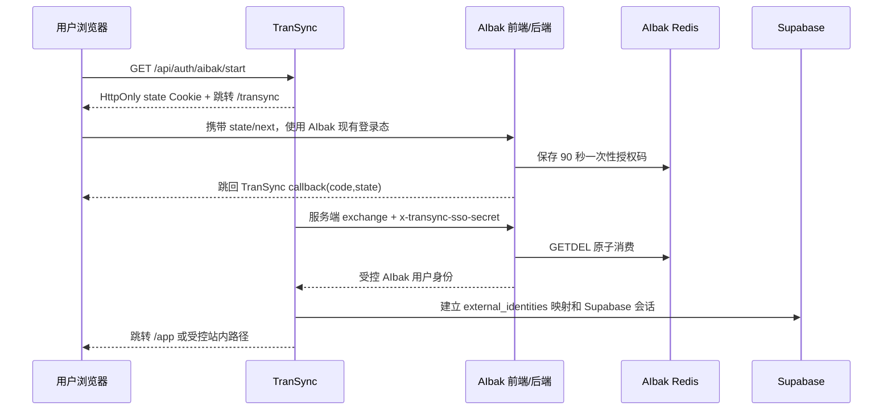

# AIbak × TranSync 实时翻译集成

> 最后更新：2026-07-22。本文只记录代码与部署契约，不包含任何真实微信、Stripe、Supabase 或翻译供应商密钥。

## 已实现

- AIbak 主导航“工具与分析”中新增 **实时翻译**。
- 站内路由：`/transync`。
- 页面从 TranSync 的 `/embed.js` 加载 inline 工作台，不在 AIbak 重复实现翻译引擎。
- 组件加载失败时显示重试和“打开完整翻译器”降级入口。
- `VITE_TRANSYNC_URL` 缺失或非法时不生成不可用链接，而是显示明确配置提示。
- URL 只允许 HTTPS；本地开发例外允许 `http://localhost` / `127.0.0.1`。
- 生产 Nginx CSP 只额外信任 `https://translate.aibak.site` 的脚本。
- 已实现 AIbak 登录态到 TranSync Supabase 会话的 90 秒一次性授权码桥接；不转发 AIbak JWT，不共享 Cookie。

## 生产部署契约

### 1. 部署 TranSync

推荐域名：

```text
https://translate.aibak.site
```

TranSync 生产环境至少设置：

```text
NEXT_PUBLIC_APP_URL=https://translate.aibak.site
NEXT_PUBLIC_SITE_URL=https://translate.aibak.site
PUBLIC_BASE_URL=https://translate.aibak.site
TRANSLATE_CORS_ORIGINS=https://aibak.site,https://www.aibak.site,https://translate.aibak.site
```

翻译供应商、Supabase、微信支付和可选 Stripe 变量按 TranSync 的 `DEPLOY.md` 安全注入。 上线前必须按顺序执行 TranSync 的 `0001_init.sql` 至 `0007_voice_growth_analytics.sql`；`0006` 用于阻止微信/Stripe 重复回调造成权益重复发放，`0007` 用于实时语音漏斗事件与生产 readiness。TranSync 还必须设置 `RATE_LIMIT_BACKEND=supabase`、`AIBAK_PORTAL_URL=https://www.aibak.site`、`AIBAK_API_URL=https://www.aibak.site` 和服务端 `TRANSYNC_SSO_CLIENT_SECRET`。不得把真实密钥写入 AIbak 客户端环境变量。

### 2. 构建 AIbak 客户端

在 `client/.env.production` 或 CI 的客户端构建环境设置：

```text
VITE_TRANSYNC_URL=https://translate.aibak.site
```

这是 Vite **构建时变量**，只能包含公开 TranSync origin。共享密钥必须只在 AIbak 服务端设置：

```text
TRANSYNC_BASE_URL=https://translate.aibak.site
TRANSYNC_SSO_CLIENT_SECRET=<与 TranSync 一致的至少 48 字符强随机密钥>
```

修改后必须重新执行客户端构建和部署：

```bash
cd client
npm ci
npm run test
npm run build
```

### 3. CSP 与跨域方向

两边必须同时正确：

1. AIbak 的 CSP `script-src` 允许浏览器加载 `https://translate.aibak.site/embed.js`。
2. TranSync 的 `TRANSLATE_CORS_ORIGINS` 允许来自 `https://aibak.site` 和 `https://www.aibak.site` 的 `/api/translate` 请求。

当前 `deploy/nginx-runtime.conf` 已放行预定生产翻译域名。如果最终不用该域名，必须同步修改 CSP 和 `VITE_TRANSYNC_URL`，不能只改其中一项。


## 一次性授权码 SSO 流程



安全要求：生产双方 origin 必须是 HTTPS；授权码重放必须返回失败；state 不匹配必须失败；`TRANSYNC_SSO_CLIENT_SECRET` 只能进入服务端密钥存储，禁止放入 `VITE_*`、Git、日志或浏览器响应。

## 本地联调

TranSync：

```powershell
cd C:\Users\Administrator\Documents\多语言实时翻译
npm run dev:web
```

AIbak 客户端创建本地私有环境文件（不要提交）：

```text
# client/.env.local
VITE_TRANSYNC_URL=http://localhost:3000
```

然后启动：

```powershell
cd G:\项目成品及测试\AIBAK\reasoni-deepseek\ai-agent-platform\client
npm run dev
```

打开 `http://localhost:5173/transync`。TranSync 本地环境的 `TRANSLATE_CORS_ORIGINS` 需包含 `http://localhost:5173`。

## 微信收款复用边界

- AIbak 与 TranSync 可使用同一个微信支付商户通道和安全变量契约。
- TranSync 必须使用自己的回调地址：`https://translate.aibak.site/api/payments/wechat/webhook`。
- 不能把 AIbak 的回调 URL 直接复制给 TranSync，也不能把私钥打包进浏览器。
- 上线前必须执行小额真实交易，核验下单、二维码、回调验签、金额校验、订单入账和订阅权益发放。
- 两产品现已通过一次性授权码建立统一登录体验，但仍不共享原始 JWT、Cookie、Supabase Token、支付订单表或订阅数据库；翻译订阅和账单归 TranSync 管理。

## 验收清单

- [ ] `https://translate.aibak.site/api/health` 返回可用翻译提供商状态。
- [ ] `https://translate.aibak.site/api/health/ready` 返回 HTTP 200 且 `ready: true`。
- [ ] AIbak 已登录用户点击统一入口后直接进入 TranSync `/app?mode=voice`，默认打开实时语音工作台，刷新会话仍有效。
- [ ] 重放同一授权码以及篡改 state 均失败。
- [ ] `https://www.aibak.site/transync` 能显示 inline 文本翻译工作台，并能通过统一登录按钮进入实时语音模式。
- [ ] 浏览器控制台无 CSP、CORS 或 mixed-content 错误。
- [ ] 中英文互译返回真实译文而不是 mock 内容。
- [ ] 组件断网或服务异常时出现站外降级入口。
- [ ] 微信小额支付后订单为 `paid` 且权益为 `fulfilled`。
- [ ] 重放同一微信/Stripe 支付事件不会重复延长订阅权益。
- [ ] `/ops` 能看到订单，失败权益可受控重试。

